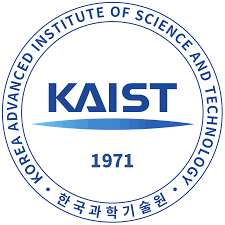
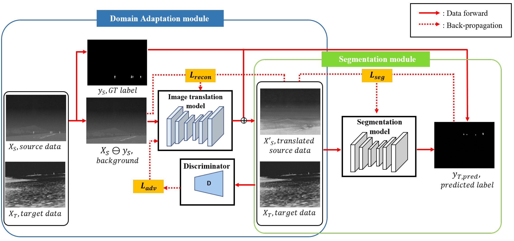
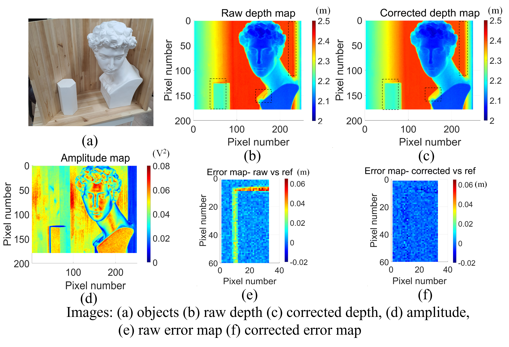
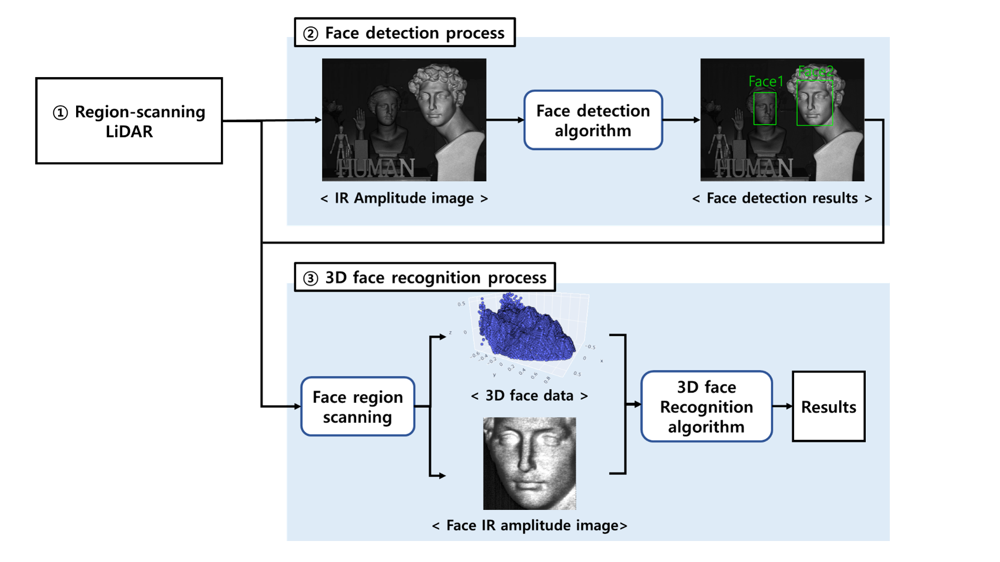
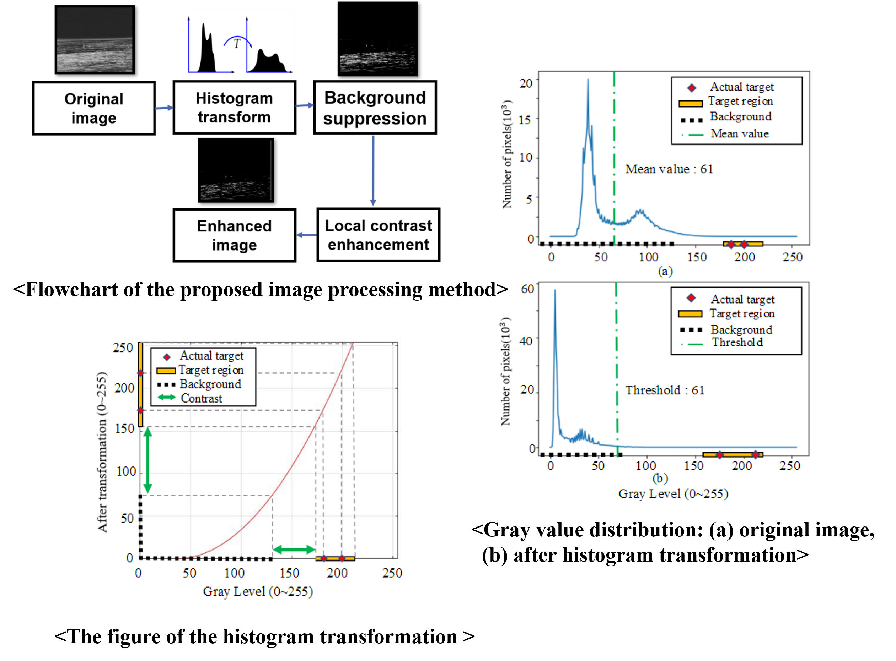
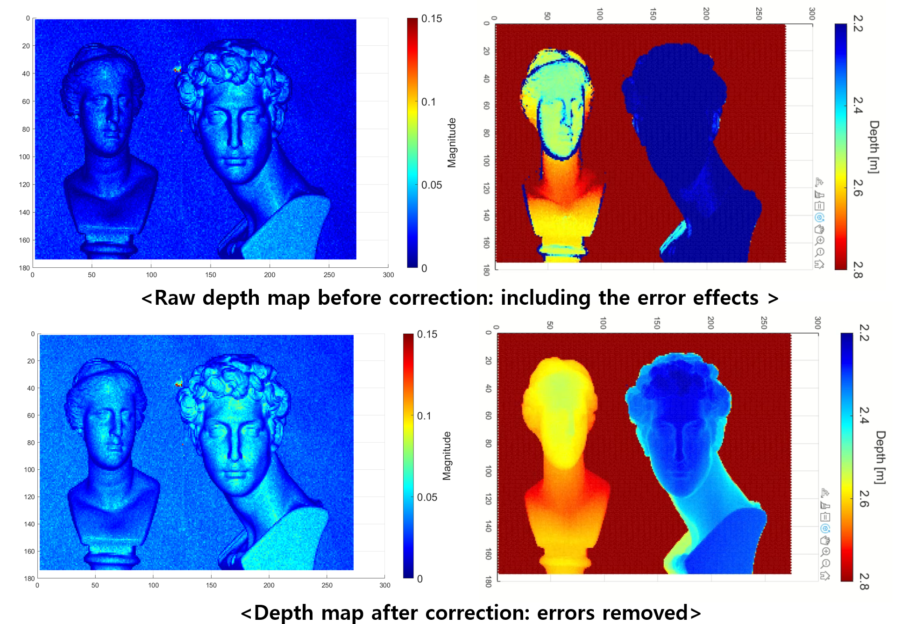

About Me
----
I am Sungjin Cheong working for [LG Innotek Company](https://www.lginnotek.com/main/main.do?locale=en) developing direct Time-of-Flight (dToF) SPAD-LiDAR perception & signal processing software. Currently, I am working on methodologies to incorporate ML algorithms into statistical signal processing and DL-based approach into 3D data processing.

Prior to that, I obtained my M.S. degree in Mechanical Engineering at [Korea Advanced Institute of Science and Technology (KAIST)](https://me.kaist.ac.kr/eng/main/main.html), under the supervision of [Prof. Yong-Hwa Park](https://scholar.google.com/citations?user=LtZKH8wAAAAJ&hl=ko). In my master's research, I mainly researched **sensing platforms and vision-based algorithms**, including **TIR remote sensing system** and **iToF LiDAR platform**. Also I worked on **computer vision** and **domain adaptation** algorithms for synthetic data. 

I did my B.S. in Mechanical Engineering at [Yonsei University](https://me.yonsei.ac.kr/me_en/index.do).

Biography
------

    
    

        <strong>LG Innotek Inc.</strong>, Seoul, Republic of Korea
        LiDAR Software Engineer, Base Technology Lab
    

    

        Aug. 2023 - Present
    

 

    
    

        <strong>KAIST</strong>, Daejon, Republic of Korea
        M.S. in Mechanical Engineering
        
            <a href="https://human.kaist.ac.kr/" target="_blank" style="text-decoration: none;">Human-Machine Interaction Lab</a>
        
    

    

        Aug. 2023 - Present
    

 

    
    

        <strong>Yonsei University</strong>, Seoul, Republic of Korea
        B.S. in Mechanical Engineering
    

    

        Mar. 2014 - Aug. 2021
    

Publications
------

    
    

        <strong>Thermal-Infrared Remote-Target Detection System for Maritime Rescue Using  3-D Game-Based Data Augmentation With GAN
        </strong>
         
        <strong>Sungjin Cheong</strong>, Wonhu Jung, Yoon Seop Lim, Yong-Hwa Park
         
        <strong>IEEE Transactions on Geoscience and Remote Sensing</strong> (2024)
         
         
        <a href="https://human.kaist.ac.kr/" target="_blank" style="text-decoration: none;">[pdf]</a>
    

 

    
    

        <strong>LiDAR Blooming Artifacts Estimation Method Induced by Retro-Reflectance With Synthetic Data Modeling and Deep Learning</strong>
         
        <strong>Sungjin Cheong</strong>, Jusung Ha
         
        <strong>IEEE International Conference on Consumer Electronics-Asia (ICCE-Asia)</strong> (2024)
         
         
        <a href="https://human.kaist.ac.kr/" target="_blank" style="text-decoration: none;">[pdf]</a>
    

 

    
    

        <strong>Infrared Image-Based Remote Target Detection for Maritime Rescue Utilizing a Deep Learning Network and Data Augmentation
        </strong>
         
        <strong>Sungjin Cheong</strong>, Yoon Seop Lim, Wonho Jung, Yong-Hwa Park
         
        <strong>Proc. of SPIE</strong>, (2023)
         
         
        <a href="https://human.kaist.ac.kr/" target="_blank" style="text-decoration: none;">[pdf]</a>
    

 

    
    

        <strong>MEMS-Based Indirect Time-of-Flight Scanning LiDAR With Parallel-Phase Demodulation and Multipath Interference Suppression
        </strong>
         
        Sunghyun Lee, Yoon Seop Lim, <strong>Sungjin Cheong</strong>, Yong-Hwa Park
         
        <strong>Proc. of SPIE</strong>, (2023)
         
         
        <a href="https://human.kaist.ac.kr/" target="_blank" style="text-decoration: none;">[pdf]</a>
    

 

    
    

        <strong>A Long-Distance 3D Face Recognition Architecture Utilizing MEMS-Based Region-Scanning LiDAR
        </strong>
         
         Yoon Seop Lim, Sunghyun Lee, <strong>Sungjin Cheong</strong>, Yong-Hwa Park
         
        <strong>Proc. of SPIE</strong>, (2023)
         
         
        <a href="https://human.kaist.ac.kr/" target="_blank" style="text-decoration: none;">[pdf]</a>
    

 

    
    

        <strong>Head Pose Estimation Method Using Depth Camera Based on 3D Point Cloud
        </strong>
         
        <strong>Sungjin Cheong</strong>,  Sunghyun Lee, Yoon Seop Lim, Yong-Hwa Park
         
        <strong>Conference of The Korean Society of Mechanical Engineers</strong>, (2022)
         
         
        <a href="https://human.kaist.ac.kr/" target="_blank" style="text-decoration: none;">[pdf]</a>
    

 

    
    

        <strong>Validation of Simulation Model for 3D Indirect Time-of-Flight Sensor 
        </strong>
         
        Sunghyun Lee, Yoon Seop Lim, <strong>Sungjin Cheong</strong>, Yong-Hwa Park
         
        <strong>Conference of The Korean Society of Mechanical Engineers</strong>, (2022)
         
         
        <a href="https://human.kaist.ac.kr/" target="_blank" style="text-decoration: none;">[pdf]</a>
    

 

    
    

        <strong>Infrared Small Object Detection Based on Histogram Transformation 
        </strong>
         
        <strong>Sungjin Cheong</strong>, Wonho Jung, Yong-Hwa Park
         
        <strong>Conference of The Korean Society of Mechanical Engineers</strong>, (2022)
         
         
        <a href="https://human.kaist.ac.kr/" target="_blank" style="text-decoration: none;">[pdf]</a>
    

 

    
    

        <strong>Depth Image Super Resolution Method for Time-of-Flight Camera Using Single Image Depth Estimation 
        </strong>
         
        Yoon Seop Lim, Sunghyun Lee, <strong>Sungjin Cheong</strong>, Yong-Hwa Park
         
        <strong>Conference of The Korean Society of Mechanical Engineers</strong>, (2022)
         
         
        <a href="https://human.kaist.ac.kr/" target="_blank" style="text-decoration: none;">[pdf]</a>
    

 

    
    

        <strong>Depth Error Correction of 3D Scanning Sensor Using Machine Learning 
        </strong>
         
        Sunghyun Lee, Yoon Seop Lim, <strong>Sungjin Cheong</strong>, Yong-Hwa Park
         
        <strong>Conference of The Korean Society of Mechanical Engineers</strong>, (2022)
         
         
        <a href="https://human.kaist.ac.kr/" target="_blank" style="text-decoration: none;">[pdf]</a>
    

 

Current Projects
------

    
    

        <strong>LiDAR Perception & Signal Processing Software
        </strong>
         
        LG Innotek Inc., Seoul, Republic of Korea
         
         
        <strong>Goals:</strong> Develop robust scanning LiDAR software algorithms to address issues caused by low-reflectivity objects, retro-reflectance, mirror-like objects, and adverse weather conditions.
         
        (Role: Signal Processing, ML/DL, 3D Vision)
         
        <a href="https://human.kaist.ac.kr/" target="_blank" style="text-decoration: none;">[Link]</a>
    

    

        Aug. 2023 - Present
    

 

Past Projects
------

    
    

        <strong>Educational Content for Autonomous Driving with CARLA
        </strong>
         
        Divine Technology Inc., Seoul, Republic of Korea
         
         
        <strong>Achieved Outcomes:</strong> Produced online educational material and corresponding CARLA simulation practice code targeted to undergraduate and graduate school students, consisting of perception, decision, and control.
         
        (Role: Camera, LiDAR perception part including lane detection, calibration, 2D/3D object detection, tracking etc.)
         
        <a href="https://human.kaist.ac.kr/" target="_blank" style="text-decoration: none;">[Link]</a>
    

    

        Aug. 2023 - Present
    

 

    
    

        <strong>Radar, LiDAR, and Camera Sensor Integrated Platform
        </strong>
         
        LG Innotek Inc., Seoul, Republic of Korea
         
         
        <strong>Achieved Outcomes:</strong> Develop integrated automotive sensors software platform.
         
        (Role: (Full) 3D data processing, LiDAR noise analysis, Human & Object tracking algorithm, (Partly) Integrated sensor setup in vehicle, Sensor viewer GUI programming)
         
        <a href="https://human.kaist.ac.kr/" target="_blank" style="text-decoration: none;">[Link]</a>
    

    

        Aug. 2023 - Present
    

 

    
    

        <strong>Infrared Monitoring AI System For Maritime Rescue
        </strong>
         
        Korean Coast Guard, Incheon, Republic of Korea
         
         
        <strong>Achieved Outcomes:</strong> Designed thermal-infrared target detection system specified for unmanned coast guard boats for maritime rescue search tasks.
         
        (Role: Project leader, Dataset acquisition, Experiment, Overall framework design)
         
        <a href="https://human.kaist.ac.kr/" target="_blank" style="text-decoration: none;">[Link]</a>
    

    

        Aug. 2023 - Present
    

 

    
    

        <strong>iToF Scanning LiDAR Platform and Its Application Software
        </strong>
         
        Intek Plus Inc., Daejon, Republic of Korea
         
         
        <strong>Achieved Outcomes:</strong> Proposed miniaturized indirect time-of-flight AMCW LiDAR system and its application software tailored to driver monitoring system (DMS) and highly precise 3D scanner.
         
        (Role: (Full) Development of LiDAR application software, (Partly) Optical system design & Signal-processing)
         
        <a href="https://human.kaist.ac.kr/" target="_blank" style="text-decoration: none;">[Link]</a>
    

    

        Aug. 2023 - Present
    

 