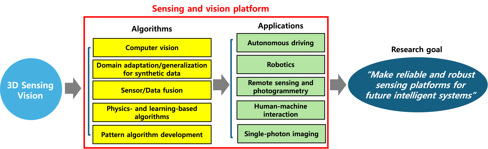
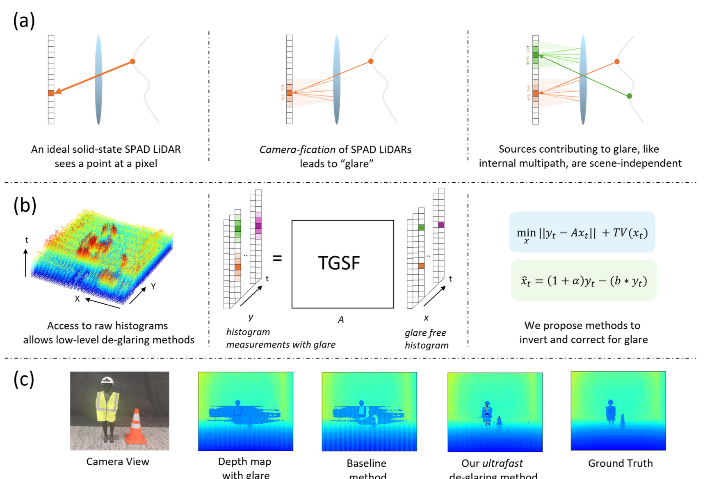
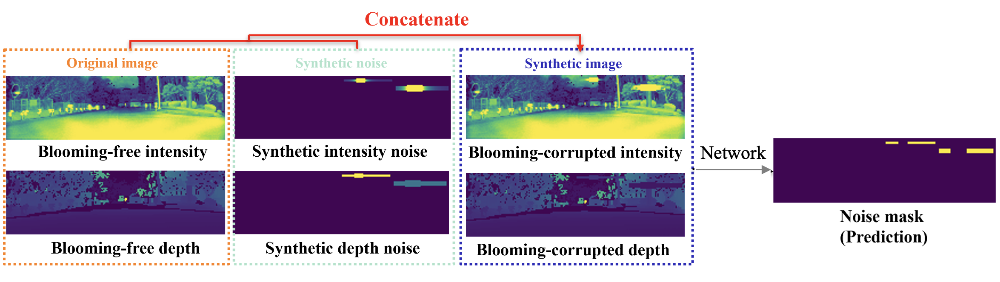
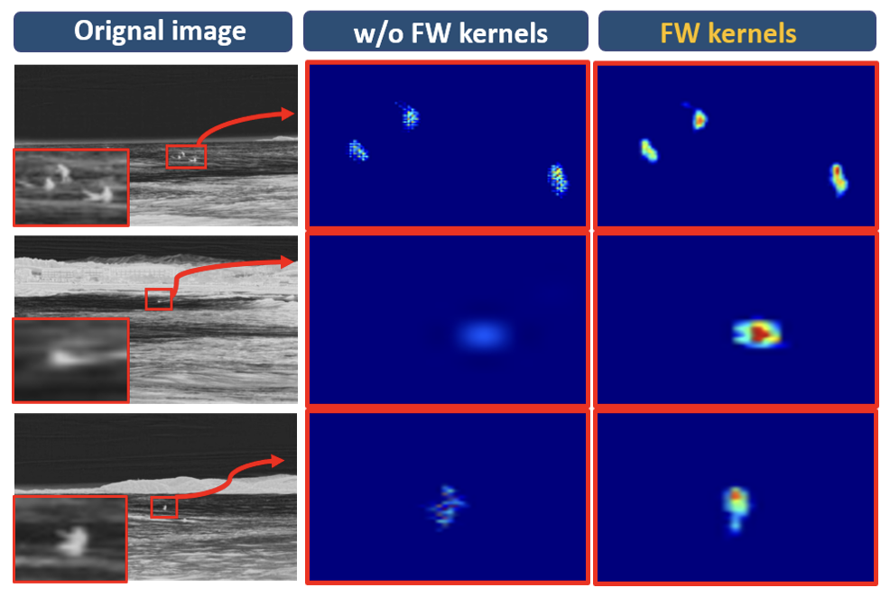
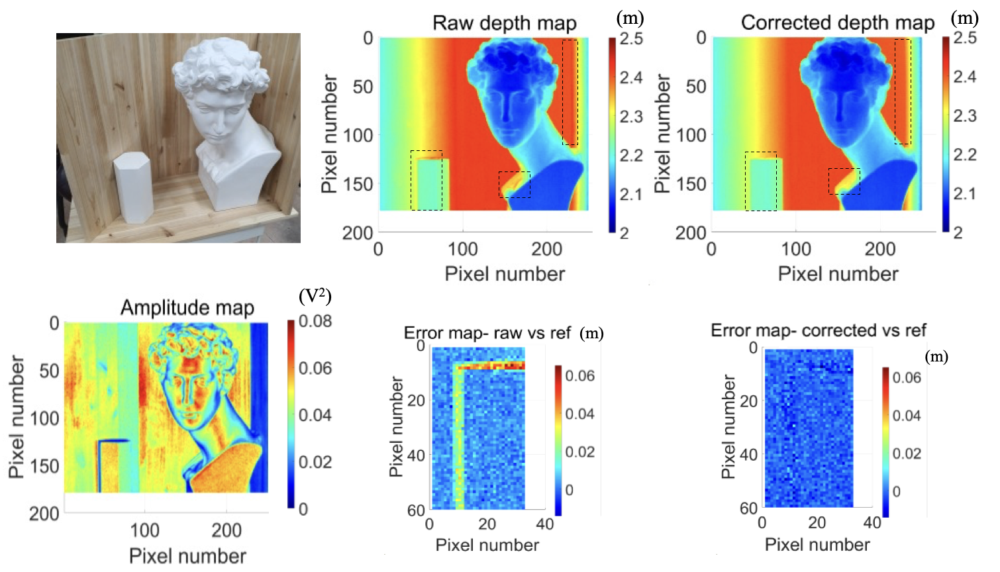
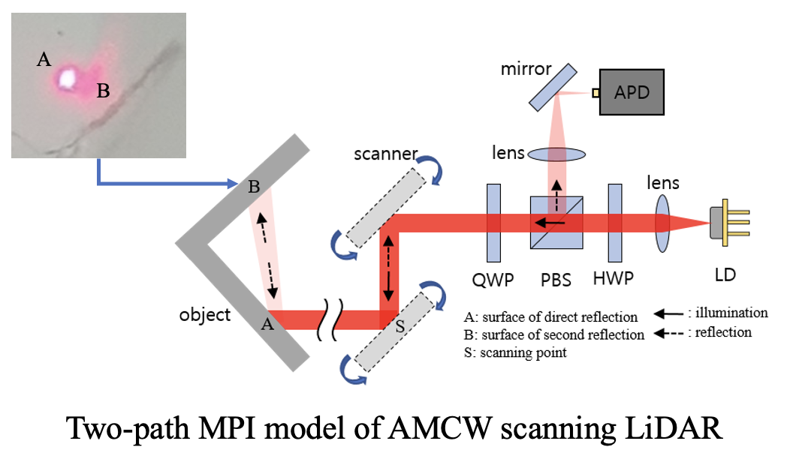
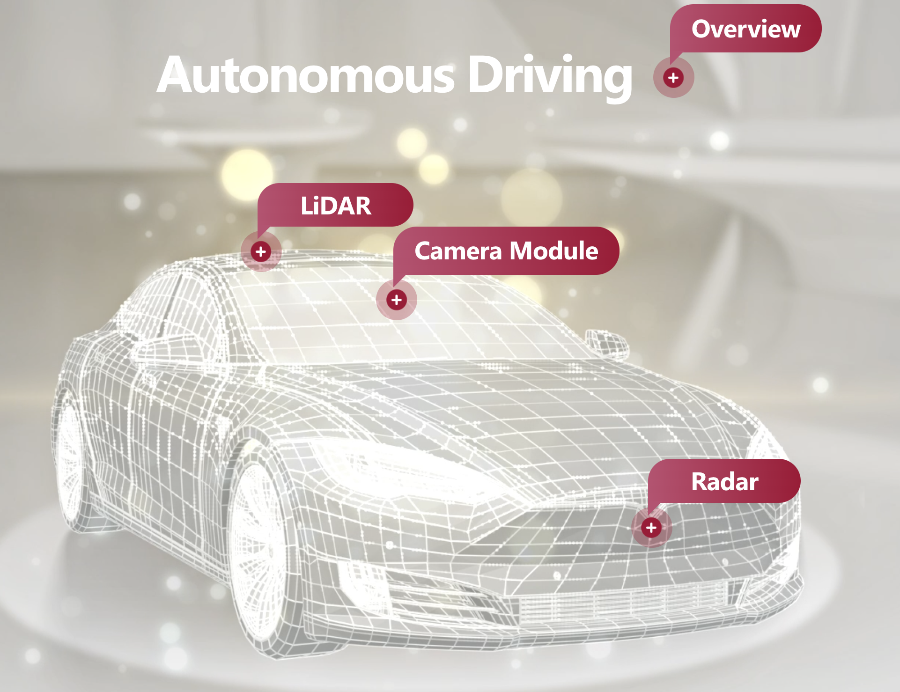
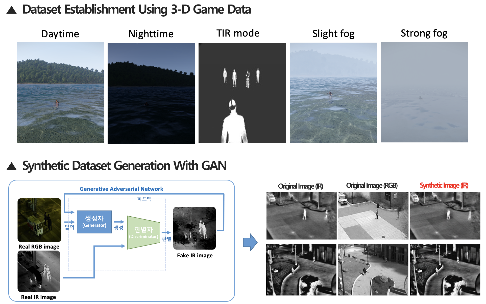

----

I am a Ph.D. student in Computer Sciences at the [WISION Lab](https://wisionlab.com/) at the **University of Wisconsin–Madison**, advised by Prof. Mohit Gupta. My research focuses on **computational imaging** and **computer vision**, with an emphasis on:

* RGB + low-cost ToF sensor fusion for robot vision (multi-modal depth/semantic estimation, mapping, tracking)
* VLMs for open-vocabulary robot tasks (grounding language queries in 2D/3D, zero-shot semantic reasoning)
* ToF/LiDAR computational imaging (denoising, signal processing, robust depth under low SNR, stray light/blooming/MPI)
* Physics- and learning-based modeling of ToF measurements (histogram/correlation-domain formulations, simulation-driven evaluation)

Previously, I worked at **LG Innotek** developing direct Time-of-Flight (dToF) signal and image processing algorithms.

I received my M.S. in Mechanical Engineering from **Korea Advanced Institute of Science and Technology (KAIST)**, advised by Prof. Yong-Hwa Park, and my B.S. in Mechanical Engineering from **Yonsei University**.

 

<!-- # Research Interests & Goals
---
My research interests lie in . My long-term research goal is to develop **precise and robust sensing systems** that will benefit **future intelligent systems** such as self-driving car, robotics, human-machine interaction, remote sensing, etc. -->

<!-- 

    

 -->

<!--   --> 
 

# Education
---

    
    

        <strong>University of Wisconsin–Madison</strong>, Madison, WI, USA
        Ph.D. in Computer Sciences
    

    

        Aug. 2025 - Present
    

 

    
    

        <strong>KAIST</strong>, Daejeon, Republic of Korea
        M.S. in Mechanical Engineering
    

    

        Sep. 2021 - Aug. 2023
    

 

    
    

        <strong>Yonsei University</strong>, Seoul, Republic of Korea
        B.S. in Mechanical Engineering
        - Military Service (2015-2017)
    

    

        Mar. 2014 - Aug. 2021
    

 
 
<section id='publications'>
<h1>Publications</h1>

 

    
    

        <strong>Ghosts in the Point Clouds: De-glaring
LiDAR in the Transient Domain</strong>
         
        Avery Gump, Connor Andrew Henley, <strong>Sungjin Cheong</strong>, Akarsh Prabhakara, Mohit Gupta 
         
        <strong>In Proceedings of the IEEE/CVF Conference on Computer Vision and Pattern
Recognition (CVPR)</strong> (2026)
         
         
        <a href="https://" target="_blank" style="text-decoration: none;">[Link]</a>
        <a href="https://" target="_blank" style="text-decoration: none;">[Details]</a>
    

 

    
    

        <strong>Thermal-Infrared Remote-Target Detection System for Maritime Rescue Using  3-D Game-Based Data Augmentation With GAN
        </strong>
         
         <strong>Sungjin Cheong</strong>, Wonhu Jung, Yoon Seop Lim, Yong-Hwa Park
         
        <strong>IEEE Transactions on Geoscience and Remote Sensing</strong> (2024, IF: 8.6)
         
         
        <a href="https://doi.org/10.1109/TGRS.2024.3454983" target="_blank" style="text-decoration: none;">[Link]</a>
        <!-- <a href="https://sjcheong21.github.io/publications/TRGS" target="_blank" style="text-decoration: none;">[Details]</a> -->
        <a href="https://sites.google.com/view/sungjin-website/publications-conferences/tistd-trgs" target="_blank" style="text-decoration: none;">[Details]</a>
    

 

    
    

        <strong>LiDAR Blooming Artifacts Estimation Method Induced by Retro-Reflectance With Synthetic Data Modeling and Deep Learning</strong>
         
        <strong>Sungjin Cheong</strong>, Jusung Ha
         
        <strong>IEEE International Conference on Consumer Electronics-Asia (ICCE-Asia)</strong> (2024)
         
         
        <a href="https://ieeexplore.ieee.org/abstract/document/10774004" target="_blank" style="text-decoration: none;">[Link]</a>
        <a href="https://sites.google.com/view/sungjin-website/publications-conferences/lidar-blooming" target="_blank" style="text-decoration: none;">[Details]</a>
    

 

    
    

        <strong>Infrared Image-Based Remote Target Detection for Maritime Rescue Utilizing a Deep Learning Network and Data Augmentation
        </strong>
         
        <strong>Sungjin Cheong</strong>, Yoon Seop Lim, Wonho Jung, Yong-Hwa Park
         
        <strong>Proc. of SPIE</strong>, (2023)
         
         
        <a href="https://doi.org/10.1117/12.2649806" target="_blank" style="text-decoration: none;">[Link]</a>
        <a href="https://sites.google.com/view/sungjin-website/publications-conferences/tistd-spie" target="_blank" style="text-decoration: none;">[Details]</a>
    

 

    
    

        <strong>MEMS-Based Indirect Time-of-Flight Scanning LiDAR With Parallel-Phase Demodulation and Multipath Interference Suppression
        </strong>
         
        Sunghyun Lee, Yoon Seop Lim, <strong>Sungjin Cheong</strong>, Yong-Hwa Park
         
        <strong>Proc. of SPIE</strong>, (2023)
         
         
        <a href="https://doi.org/10.1117/12.2649693" target="_blank" style="text-decoration: none;">[Link]</a>
        <a href="https://sites.google.com/view/sungjin-website/publications-conferences/mpi-suppression" target="_blank" style="text-decoration: none;">[Details]</a>
    

 

    
    

        <strong>A Long-Distance 3D Face Recognition Architecture Utilizing MEMS-Based Region-Scanning LiDAR
        </strong>
         
        Yoon Seop Lim, Sunghyun Lee, <strong>Sungjin Cheong</strong>, Yong-Hwa Park
         
        <strong>Proc. of SPIE</strong>, (2023)
         
         
        <a href="https://doi.org/10.1117/12.2649500" target="_blank" style="text-decoration: none;">[Link]</a>
        <a href="https://sites.google.com/view/sungjin-website/publications-conferences/face-recognition" target="_blank" style="text-decoration: none;">[Details]</a>
    

 

    
    

        <strong>Head Pose Estimation Method Using Depth Camera Based on 3D Point Cloud
        </strong>
         
        <strong>Sungjin Cheong</strong>,  Sunghyun Lee, Yoon Seop Lim, Yong-Hwa Park
         
        <strong>Conference of The Korean Society of Mechanical Engineers</strong>, (2022)
         
         
        <a href="https://www.dbpia.co.kr/Journal/articleDetail?nodeId=NODE11181942" target="_blank" style="text-decoration: none;">[Link]</a>
        <a href="https://sites.google.com/view/sungjin-website/publications-conferences/head-pose-estimation" target="_blank" style="text-decoration: none;">[Details]</a>
    

 

    
    

        <strong>Validation of Simulation Model for 3D Indirect Time-of-Flight Sensor 
        </strong>
         
        Sunghyun Lee, Yoon Seop Lim, <strong>Sungjin Cheong</strong>, Yong-Hwa Park
         
        <strong>Conference of The Korean Society of Mechanical Engineers</strong>, (2022)
         
         
        <a href="https://www.dbpia.co.kr/journal/articleDetail?nodeId=NODE11182118" target="_blank" style="text-decoration: none;">[Link]</a>
        <a href="https://sites.google.com/view/sungjin-website/publications-conferences/itof-simulation" target="_blank" style="text-decoration: none;">[Details]</a>
    

 

    
    

        <strong>Infrared Small Object Detection Based on Histogram Transformation 
        </strong>
         
        <strong>Sungjin Cheong</strong>, Wonho Jung, Yong-Hwa Park
         
        <strong>Conference of The Korean Society of Mechanical Engineers</strong>, (2022)
         
         
        <a href="https://www.dbpia.co.kr/Journal/articleDetail?nodeId=NODE11061948" target="_blank" style="text-decoration: none;">[Link]</a>
    

 

    
    

        <strong>Depth Image Super Resolution Method for Time-of-Flight Camera Using Single Image Depth Estimation 
        </strong>
         
        Yoon Seop Lim, Sunghyun Lee, <strong>Sungjin Cheong</strong>, Yong-Hwa Park
         
        <strong>Conference of The Korean Society of Mechanical Engineers</strong>, (2022)
         
         
        <a href="https://www.dbpia.co.kr/Journal/articleDetail?nodeId=NODE11061915" target="_blank" style="text-decoration: none;">[Link]</a>
        <a href="https://sites.google.com/view/sungjin-website/publications-conferences/super-resolution" target="_blank" style="text-decoration: none;">[Details]</a>
    

 

    
    

        <strong>Depth Error Correction of 3D Scanning Sensor Using Machine Learning 
        </strong>
         
        Sunghyun Lee, Yoon Seop Lim, <strong>Sungjin Cheong</strong>, Yong-Hwa Park
         
        <strong>Conference of The Korean Society of Mechanical Engineers</strong>, (2022)
         
         
        <a href="https://www.dbpia.co.kr/Journal/articleDetail?nodeId=NODE11061919" target="_blank" style="text-decoration: none;">[Link]</a>
        <a href="https://sites.google.com/view/sungjin-website/publications-conferences/depth-error-correction" target="_blank" style="text-decoration: none;">[Details]</a>
    

</section>
 
 

<section id='Past Projects'>
<h1>Past Projects</h1>

 

    
    

        <strong>Educational Content for Autonomous Driving with CARLA
        </strong>
         
        Divine Technology Inc., Seoul, Republic of Korea
         
         
        <strong>Achieved Outcomes:</strong> Produced online educational material and corresponding CARLA simulation practice code targeted to undergraduate and graduate school students, consisting of perception, decision, and control.
         
        (Role: Camera, LiDAR perception part including lane detection, calibration, 2D/3D object detection, tracking etc.)
         
        <a href="https://human.kaist.ac.kr/" target="_blank" style="text-decoration: none;">[Link]</a>
    

    <!-- 

        Dec. 2023 - Jun. 2024
    
 -->

 

    
    

        <strong>Radar, LiDAR, and Camera Sensor Integrated Platform
        </strong>
         
        LG Innotek Inc., Seoul, Republic of Korea
         
         
        <strong>Achieved Outcomes:</strong> Develop integrated automotive sensors software platform.
         
        (Role: (Full) 3D data processing, LiDAR noise filtering, Human & Object tracking algorithm, (Partly) Integrated sensor setup in vehicle, Viewer GUI)
         
        <a href="https://lginnotek-virtualshowroom.com/autonomous-driving/" target="_blank" style="text-decoration: none;">[Link]</a>
    

    <!-- 

        Aug. 2023 - Feb.2024
    
 -->

 

    
    

        <strong>Infrared Monitoring AI System For Maritime Rescue
        </strong>
         
        Korean Coast Guard, Incheon, Republic of Korea
         
         
        <strong>Achieved Outcomes:</strong> Designed thermal-infrared target detection system specified for unmanned coast guard boats for maritime rescue search tasks.
         
        (Role: Project leader, Dataset acquisition, Experiment, Overall framework design)
         
        <a href="https://" target="_blank" style="text-decoration: none;">[Details]</a>
    

    <!-- 

        Dec. 2021 - Jun. 2023
    
 -->

 

    
    

        <strong>iToF Scanning LiDAR Platform and Its Application Software
        </strong>
         
        Intek Plus Inc., Daejon, Republic of Korea
         
         
        <strong>Achieved Outcomes:</strong> Proposed miniaturized indirect time-of-flight AMCW LiDAR system and its application software tailored to driver monitoring system (DMS) and highly precise 3D scanner.
         
        (Role: (Full) 3D computer vision, (Partly) Optical system design & Signal processing)
         
        <a href="https://sites.google.com/view/sungjin-website/projects/3d-lidar-platform" target="_blank" style="text-decoration: none;">[Details]</a>
    

    <!-- 

        Dec. 2021 - Jun. 2023
    
 -->

 
